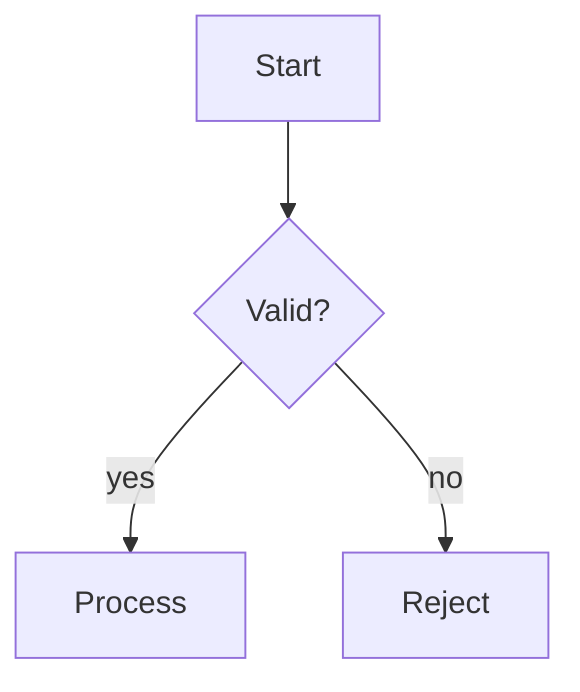
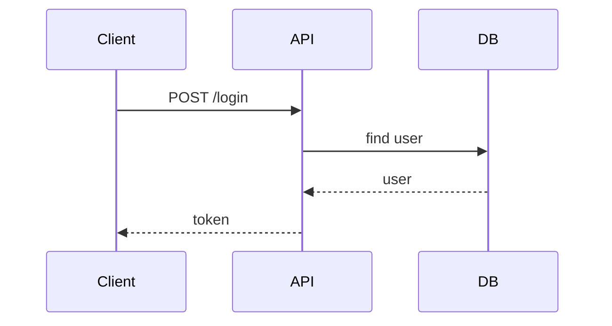
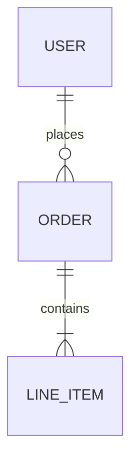
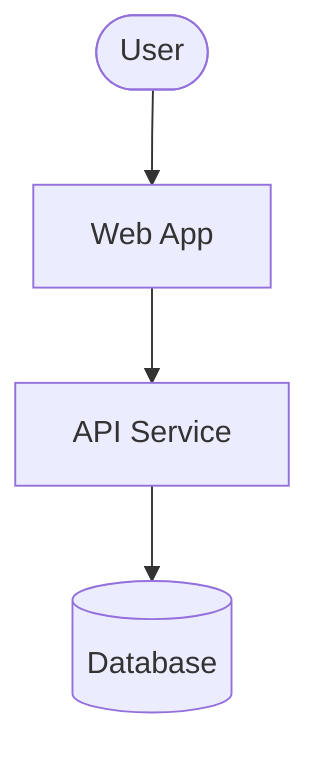
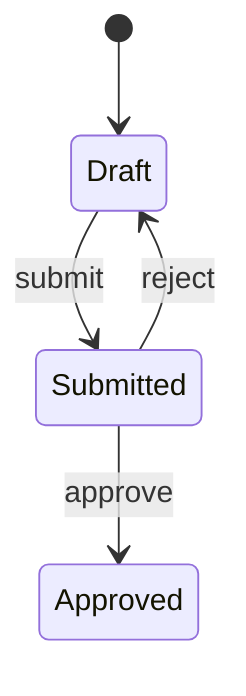
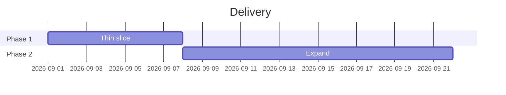
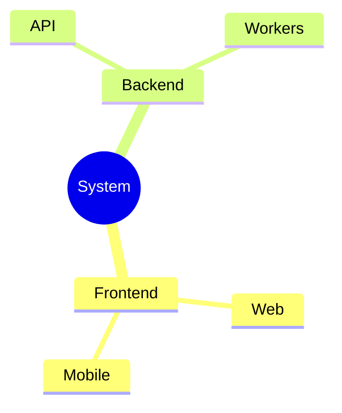
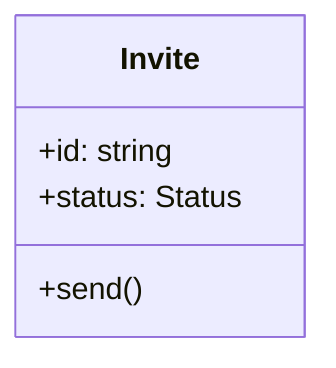

# When to use which diagram

Match the visual to the shape of the idea. Each entry: what it is for, the tell that you need it, the tell that you have the wrong type, and a minimal Mermaid starter.

## Flowchart

- **For:** a process or algorithm with steps and decision branches.
- **You need it when:** you keep writing "if... then... otherwise".
- **Wrong type when:** the thing is really messages between actors (use sequence) or states of one entity (use state).

## Sequence diagram

- **For:** interactions between actors or services over time, in order.
- **You need it when:** the point is who calls whom, in what order, and what comes back (auth flows, API round-trips, event chains).
- **Wrong type when:** there is no ordering or no second actor.

## Entity-relationship diagram

- **For:** a data model: entities, their fields, and how they relate.
- **You need it when:** explaining a schema, a many-to-many, or how tables join.
- **Wrong type when:** you are showing behavior, not structure.

## C4 (context / container / component)

- **For:** system architecture at a chosen zoom level. Context (systems and people), containers (apps, services, stores), components (inside one container).
- **You need it when:** onboarding someone to how a system fits together. Pick one level per diagram.
- **Wrong type when:** you are drilling into code (that is a class diagram) or showing a request path (sequence). Render with a flowchart using C4 grouping, or Mermaid's C4 support where available.

## State diagram

- **For:** the lifecycle of one entity: its states and the transitions between them.
- **You need it when:** something has statuses (draft, submitted, approved) and rules about moving between them.
- **Wrong type when:** the "states" are really steps done once in order (use flowchart).

## Gantt / timeline

- **For:** work or events across time; phases, milestones, dependencies.
- **You need it when:** communicating a schedule or a delivery plan. Pairs with the plan-delivery skill.
- **Wrong type when:** there is no time axis; a phased list may read better as text.

## Tree / mind map

- **For:** a hierarchy or breakdown: parts of a whole, a decomposition, an outline.
- **You need it when:** showing containment or classification with a single root.
- **Wrong type when:** items relate many-to-many (that is a graph or ERD).

## Class diagram

- **For:** types, their fields and methods, and inheritance or composition among them.
- **You need it when:** explaining an object model or a set of related interfaces.
- **Wrong type when:** you mean data persistence (ERD) or runtime behavior (sequence).

## Table or matrix (not a diagram)

- **For:** comparing options across dimensions (tradeoff tables, decision matrices).
- **You need it when:** the reader will scan across attributes. A Markdown table beats any diagram here.

## Chart (quantities)

- **For:** numbers: trends, distributions, proportions. Use the dataviz skill for anything styled or data-heavy; a quick Mermaid `pie` or `xychart` works for a single simple figure.
- **Wrong type when:** you are showing structure or flow, not magnitude.

## User flow / sitemap

- **For:** the path a person takes through a product, or the shape of its screens and routes. The structural output of the `information-architecture` skill.
- **Render as:** a flowchart for a task flow, a tree for a sitemap or route hierarchy.
- **Why it earns a picture:** a dead end, a loop, and an undesigned state are all visible in a drawn flow and invisible in a written list of screens.
- **Not:** a sequence diagram. That is for systems calling each other, not a person moving through screens.
